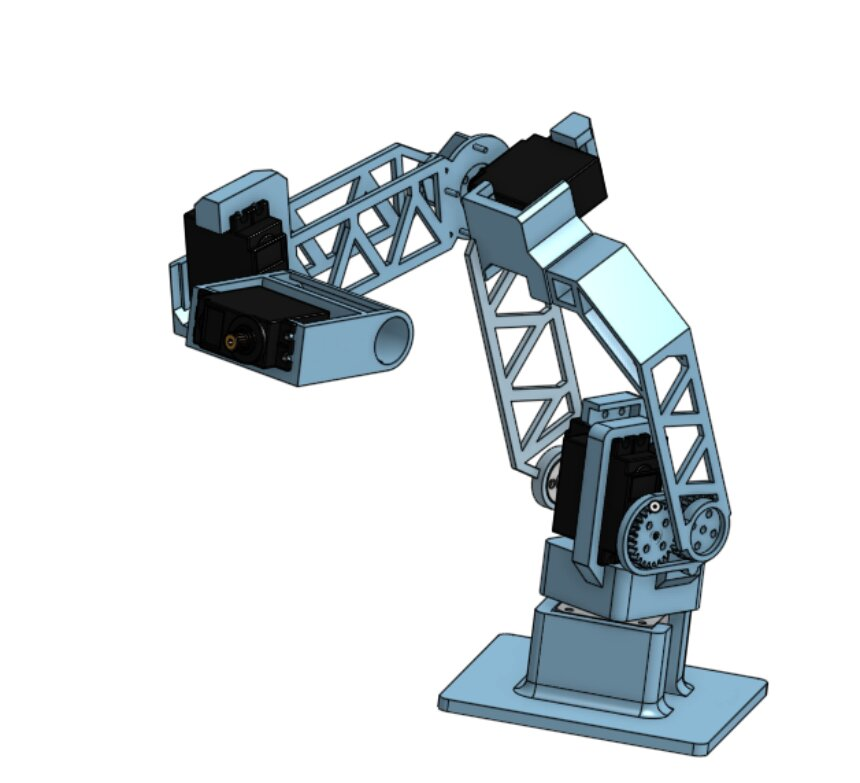
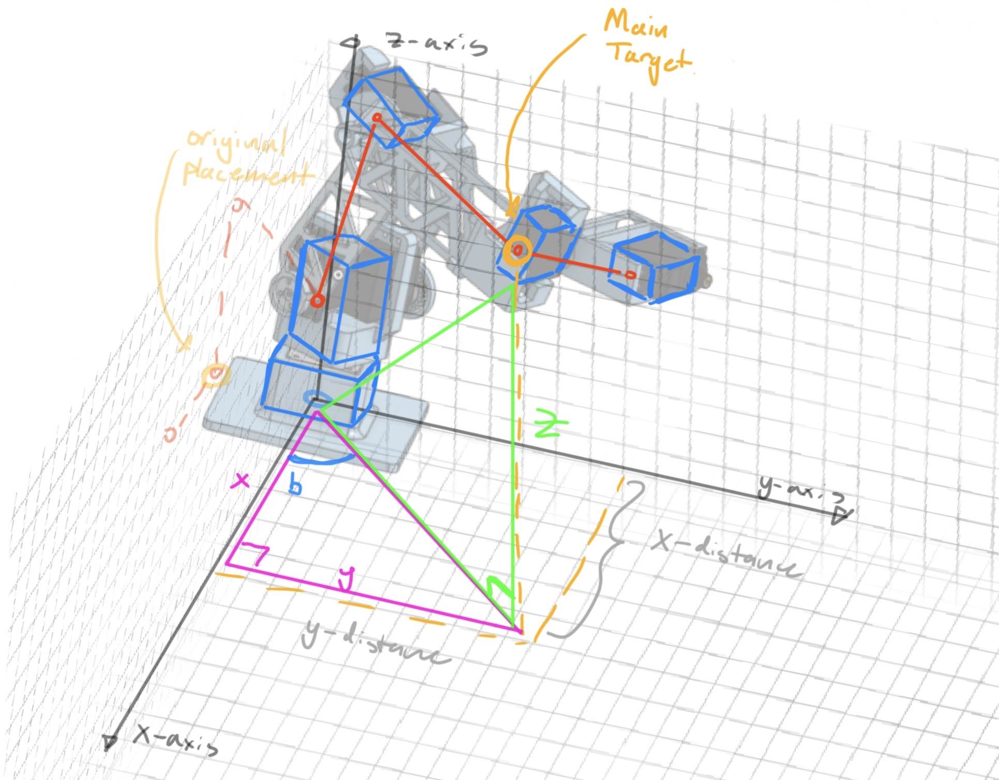
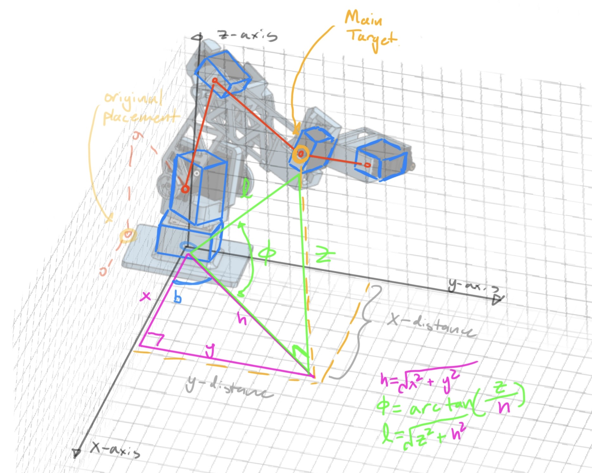
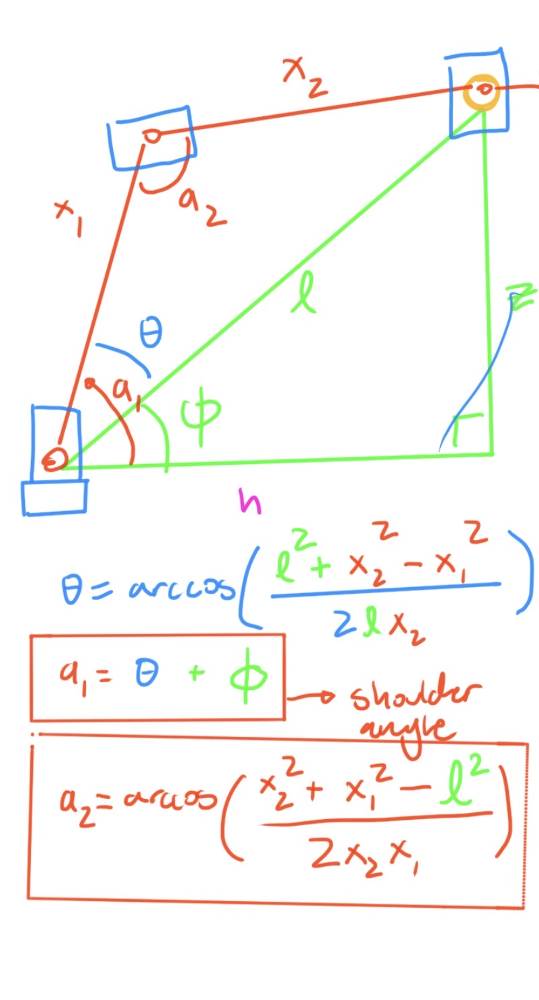
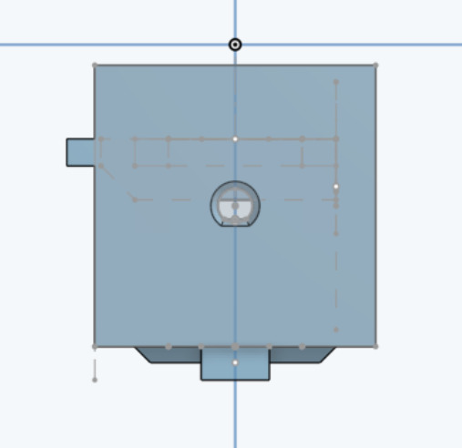
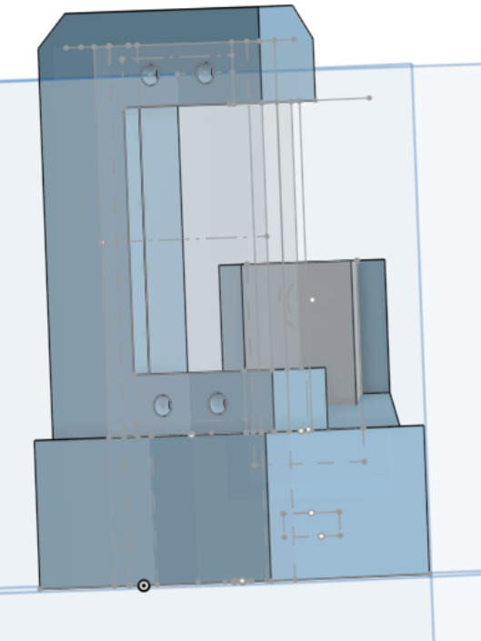
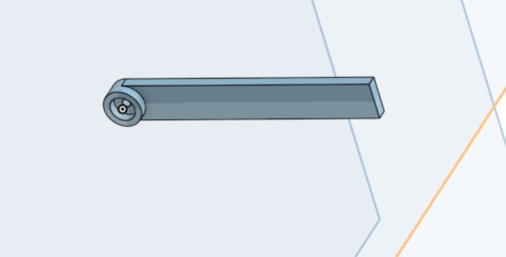

# 5 axes robotic arm
My project is an industrial five axes robotic arm that can be controlled with an app on your phone with only a couple sliders. It will be using an arduino nano esp32, a NEMA17 motor for the base rotation, and several +servos for the rest of the joints.

| **Engineer** | **School** | **Area of Interest** | **Grade** |
|:--:|:--:|:--:|:--:|
| Andrew L | Pinewood | Electrical Engineering | Incoming Sophomore


  
# Final Milestone 

**Don't forget to replace the text below with the embedding for your milestone video. Go to Youtube, click Share -> Embed, and copy and paste the code to replace what's below.**

<iframe width="560" height="315" src="https://www.youtube.com/embed/F7M7imOVGug" title="YouTube video player" frameborder="0" allow="accelerometer; autoplay; clipboard-write; encrypted-media; gyroscope; picture-in-picture; web-share" allowfullscreen></iframe>

For your final milestone, explain the outcome of your project. Key details to include are:
- What you've accomplished since your previous milestone
- What your biggest challenges and triumphs were at BSE
- A summary of key topics you learned about
- What you hope to learn in the future after everything you've learned at BSE


# Second Milestone

**Don't forget to replace the text below with the embedding for your milestone video. Go to Youtube, click Share -> Embed, and copy and paste the code to replace what's below.**

<iframe width="560" height="315" src="https://www.youtube.com/embed/YNSU6eJ5oP0?si=e27gH-r2nrB0m9gB" title="YouTube video player" frameborder="0" allow="accelerometer; autoplay; clipboard-write; encrypted-media; gyroscope; picture-in-picture; web-share" referrerpolicy="strict-origin-when-cross-origin" allowfullscreen></iframe>

This milestone is the most difficult of all three. For this milestone my goal was to code the trigonometry calculations for three motors/servos/axis to work together to get to a certain point in the x,y,z axis as well as cad the entire arm. 
# The Hardware
To save time and consider future planning, I decided to cad the entire structure of the arm, even though I am only coding for joints 1-3. Because the shoulder joint couldn't handle the weight of the rest of the arm, I added another servo to double the torque and to sync both servos together I used a gearbox and connected them to the same pin on the Arduino. To start planning for the future, I switched my original plan of the esp32 NANO into a Arduino R4. This way I can more easily make an app for milestone 3.



# The Software
I initially planned to find a library online to get all the math/angle calculations done for me (called NocKinematics). However, I didn't fully understand the code which made debugging extremely difficult. So, I decided to watch a Youtube video made by RoTechnic to figure out some of the math (Youtube link shared in the resources tab) and code it by myself. This turns out to be an extremely long process that not only surprised me in the The idea is that the arm starts off at either the x-z plane or the y-z plane, and after the base rotation, we create two right triangles to get to our desired/target point. Without any math, we can fill out the following information:



From this information we can then further calculate the lengths of the pink and green triangles using the Pythagorean theorem. We can also calculate the angle phi using arctan for future reference. These lengths will be essential for calculating the angles later on.



To actually calculate the angles for all the servos and arm, we need to focus solely on the green triangle. This green triangle is perfect for calculating the angle of only one arm. However, because we have 3 joints, we need to split this arm into two parts to calculate. This adds another triangle which I drew as red. The measurements we already know in this schematic are the given lengths of x1 and x2, as we can measure physically. We also know angle phi, hypotenuse l, and length z. To solve for a1 and a2, we need to fist solve angle theta (in blue). To do so we can use the law of cosine, after which we can then add this value to phi to get the angle a1, the angle for the shoulder joint. a2 can also be calculated using law of cosine.



With this math completed for 3 axis, we can then convert it into a function in the code that takes in the desired x, y, and z values as well as the arm lengths.
```c++
void calculations(double desired_x, double desired_y, double desired_z, double L1, double L2) {
  double HyptnsT = sqrt((desired_x * desired_x) + (desired_y * desired_y));
  double Phi = atan2(desired_z, HyptnsT) * (180 / PI);
  double HyptnsS = sqrt((HyptnsT * HyptnsT) + (desired_z * desired_z));
  double a = ((HyptnsS * HyptnsS) + (L1 * L1) - (L2 * L2)) / (2 * L1 * HyptnsS);

  a = constrain(a, -1.0, 1.0);
  double Theta = acos(a) * (180 / PI);
  Shoulder_angle = Phi + Theta;
  double a1 = ((L2 * L2) + (L1 * L1) - (HyptnsS * HyptnsS)) / (2 * L1 * L2);
  a1 = constrain(a1, -1.0, 1.0);
  Elbow_angle = acos(a1) * (180 / PI);
}
```
# First Milestone

**Don't forget to replace the text below with the embedding for your milestone video. Go to Youtube, click Share -> Embed, and copy and paste the code to replace what's below.**

<iframe width="560" height="315" src="https://www.youtube.com/embed/m9uLTFNnOn4?si=O1SvCOjb6ifLS_b_" title="YouTube video player" frameborder="0" allow="accelerometer; autoplay; clipboard-write; encrypted-media; gyroscope; picture-in-picture; web-share" referrerpolicy="strict-origin-when-cross-origin" allowfullscreen></iframe>

The final product for my project is a 5 axis industrial robotic arm that can be controlled through an app. My initial idea on how to control it was to create a group of sliders in the app to control the x,y,z values of the tip of the arm. To mimic this idea and transfer it into a prototype, I decided to get another breadboard and have six physical buttons instead of sliders. Two of the six will increase/decrease the value of the x axis, another pair will do the same for the y axis, and another pair for the z axis. However, because it is my first time working with an arduino and C++, I decided to first start off with the base and the arm joint to get some experience (as seen in the video). I cadded a simple base mount for the stepper motor and a mount for the servo. To track motor movement, I CADed a custom servo horn. I also started working on a couple CAD builds to serve as a foundation for future CAD work in Onshape. This included working on a base-mount to connect to the NEMA stepper motor, a mount for the MG996R servos, and custom servo horns to fit the servos. The idea was to have basic mounts for the major elements of my arm with the correct measurements so when I eventually create arms linking motors to motors, I can easily find and copy paste the measurements for the sketch from my foundational CAD sketches.

A couple challenges in the first milestone is getting to familiarize myself with the electrical components and the Arduino IDE. It is my first time working with electronic components and coding in C++, so I struggled with my breadboard since there were many accidental open-circuits and a lot of errors/bugs in my code because of logic traps and missing semicolons. Thankfully the BSE instructors and YouTube exists to help me understand electronics and arduino better. Another challenge I faced was getting the right measurements for the basic mount sketches for the servos/motor. To find accurate enough measurements, I searched the internet for the MG996R servo measurements as well as the NEMA17 motor measurements. My first few attempts for creating these mounts failed due to physical constraints. The annoying part for the MG996R mount was that the wiring sticks out of the casing quite a bit, so I couldn't just cut a rectangular hole in a rectangular prism. To fix this I left one side open so the servo can slide in nicely, completely ignoring the wire. The NEMA17 motor had its own unique problems. I couldn't find a precise enough measurement for the motor axle to make a part that can easily slide onto the axle while not sliding around in extra space. Even though I offsetted the hole in my CAD, the measurements were still not right and the hole was often too small for the motor axle. To fix this, I decided to ignore offsetting completely and make the inner hole that connects to the NEMA first larger than the outer one by chamfering it. This makes inserting the base onto the motor axle easy but since the hole in the base gets smaller, it ensures a tight fit on the top.

# Schematics 
For the future, I will be using my CADed objects to create arms for more servos to move up to 3 motors, then 5, then start developing the app.
| **Base for the NEMA** | **Mount for the MG996R servo** | **Custom Servo Horn** |
|:--:|:--:|:--:|
|  |  |  |

# Code 
Milestone 1 code:
```c++
#include <Servo.h>
#include <AccelStepper.h>

const int stepPin = 3;
const int dirPin = 2;

const int servLPin = 9;
const int servRPin = 8;
const int nemaLPin = 7;
const int nemaRPin = 6;

AccelStepper motor(1, stepPin, dirPin);
Servo myMotor;

int servoAngle = 90;
unsigned long lastServoMove = 0;
const int servoDelay = 15; // Controls how fast the servo sweeps (in milliseconds)

void setup() {  
  pinMode(servLPin, INPUT_PULLUP);
  pinMode(servRPin, INPUT_PULLUP);
  pinMode(nemaLPin, INPUT_PULLUP);
  pinMode(nemaRPin, INPUT_PULLUP);
  
  motor.setMaxSpeed(600);
  motor.setAcceleration(300);
  
  myMotor.attach(4);
  myMotor.write(servoAngle); 
  
  Serial.begin(9600);
}

void loop() {
  int ServoState_L = digitalRead(servLPin);
  int ServoState_R = digitalRead(servRPin);
  int NemaState_L = digitalRead(nemaLPin);
  int NemaState_R = digitalRead(nemaRPin);

  // --- STEPPER MOTOR CONTROL ---
  if (NemaState_R == LOW) { 
    motor.setSpeed(300); // Clockwise
  } 
  else if (NemaState_L == LOW){ 
    motor.setSpeed(-300); // Counter-Clockwise
  }
  else {
    motor.setSpeed(0); // Stop when no buttons pressed
  }

  // --- SERVO MOTOR CONTROL (Non-blocking) ---
  if (millis() - lastServoMove >= servoDelay) {
    if (ServoState_R == LOW && servoAngle < 180){
      servoAngle += 1;
      myMotor.write(servoAngle);
      lastServoMove = millis();
    }
    else if (ServoState_L == LOW && servoAngle > 0){
      servoAngle -= 1;
      myMotor.write(servoAngle);
      lastServoMove = millis();
    }
  }

  // Keep the stepper motor moving smoothly
  motor.runSpeed();
}
```

# Bill of Materials
Here's where you'll list the parts in your project. To add more rows, just copy and paste the example rows below.
Don't forget to place the link of where to buy each component inside the quotation marks in the corresponding row after href =. Follow the guide [here]([url](https://www.markdownguide.org/extended-syntax/)) to learn how to customize this to your project needs. 

| **Part** | **Note** | **Price** | **Link** |
|:--:|:--:|:--:|:--:|
| Arduino Nano ESP32 (With Headers) | To receive imported code, read sensors, intake and output data, and to connect to the app through either wifi or bluetooth.  | $19.30 | <a href="https://store-usa.arduino.cc/products/nano-esp32-with-headers?queryID=undefined"> Link </a> |
| High-Torque NEMA 17 Stepper Motor (40N·cm+) | To serve as the base rotation for the arm | $12.99 | <a href="https://www.amazon.com/MAKERELE-Stepper-42-40mm-Connector-Printers/dp/B0FP1QQ1NT/ref=sr_1_1_sspa?crid=18HXIK5GNN9X4&dib=eyJ2IjoiMSJ9.w7_CWW7b_PgKSALA9QxV8udsr-memgYtp87GfifCx2HeYsIRjl6XTkCV1ynyPmGS4OfvD4kWfRXm3RHfwXoMxM6KjYUrvUkfFGhb5y7bMLLFZVfh5sxU-CX509Wl6Cj8WeH0lAmJw-NNA9x41gg0Sf1X0poiVzZrVR7DJ_W6_Q0l8eWwp2Vrf4tbM7rfkv0pFrqv_n1N1TdiCyttqHT2-NcXxwMpJKYZRmVNJ0wIvGI.Nv3HsFK6ZuvQJ0PjS1KE5AMAew4PoGiolsSfBCTccuE&dib_tag=se&keywords=High-Torque%2BNEMA%2B17%2BStepper%2BMotor%2B(40N%C2%B7cm%2B)&qid=1780093547&sprefix=high-torque%2Bnema%2B17%2Bstepper%2Bmotor%2B40n%2Bcm%2B%2B%2Caps%2C134&sr=8-1-spons&sp_csd=d2lkZ2V0TmFtZT1zcF9hdGY&th=1"> Link </a> |
| A4988 Stepper Driver (With Headers & Heatsink) | To power to NEMA17 motor | $5.99 | <a href="https://www.amazon.com/outstanding-StepStick-Stepper-Printer-Robotics/dp/B082F42W3H/ref=sr_1_10?crid=2B0YTVLE36JB6&dib=eyJ2IjoiMSJ9.ej_k6Aj_Uaj-XyjS2xZRF77rDJMKwjz7-9XlRGQVxgeu62VZPQZD1gUtVPVaA7EfSS0c6oNJ4-rv7itgcQbMUmEUIwcE0AjqJ1LwD0VRp9-kIiakoPt9in1MQnYgjXvZT6SHiUk3DkqrNacS7cTSB-Slyoj6jrfiqrGj3CBgNA1jBr8IiDjXwiHXaz_nskIABoeL0aZCmzlWuG__s4YCygUX6GcR3kQpiUrkqPfIu0I.apCskpN7VNbXIX-AFn5IEzwmuPwZFj0moSsw2AbqZZI&dib_tag=se&keywords=A4988+Stepper+Driver+%28With+Headers+%26+Heatsink%29&qid=1780096058&sprefix=a4988+stepper+driver+with+headers+%26+heatsink+%2Caps%2C139&sr=8-10"> Link </a> |
| MG996R High-Torque Servos | To serve as the motor to power the joints | $9.99 | <a href="https://www.amazon.com/AEDIKO-MG996R-Control-Digital-Helicopter/dp/B09BZ5955Z/ref=sr_1_8?crid=3POB5H52CRIGJ&dib=eyJ2IjoiMSJ9.pg8M9-SDz7L_x3kdbfbU4KObUUcqsCEEX9l-IenK3F6QWH2psF50Iiz5HbD_TLt4gmc8soUObrPStUebN9TJJIxEyCvepG5ns3p959Tih6gcI7zwFov6-S98yYwczkA8-LfwXcj5qwZTJxENLCLWHmm_NasK6pIHCFgxeJ8lFT6LsP2ntNVju0UsSlQs_PgHaeUQVmFfD37fcpTsr-Pb6xaYt60eJy9quZ3yMH0saa7SP1uBMMNBOvIi80afoExhTCPn1m2BoV6qf-zxnpMOFVt1ENlyB-OxKAM9gbugb0c.OyD4HNssemftXWz-kbSg-I51I-vgX0yhb1GRZ8idn8U&dib_tag=se&keywords=MG996R%2BHigh-Torque%2BServos&qid=1780096290&sprefix=mg996r%2Bhigh-torque%2Bservos%2Caps%2C341&sr=8-8&th=1"> Link </a> |
| SG90 Micro Servos | To serve as the motor to power the claw at the end | $6.99 | <a href="https://www.amazon.com/WWZMDiB-SG90-Control-Servos-Arduino/dp/B0BKPL2Y21/ref=sr_1_1_sspa?crid=3LGHV5FBGR2AV&dib=eyJ2IjoiMSJ9.DO_8huDXG-WCdEl_xxmMGHDTUq8Gy0sMBJu8P0uFAgVHfguxcLm-es5P-FvLGv7ZFLbQs728JUKzUYPSqLilJ34yfALPhjS2x3xBGbr20Rcpy1aIBJ8HEQO-xsrA73LAvcGZBewwm7jlB5SxSdFJn3W0X7gluehcf5C_zYp1ndrp8Oyq2HJW5fDzaSggXAYKAj_RqE8-SDqptAcyOjPpajbCZFb4gUVCW_DmVkG6G6HbHUmML0xpKWUY9MV_7QnHxgCBH_v6m29wKqQAlrqTZQZenrvijjeoNHHZ2BLzbCE.Q6oll216eiWYECWTkge5HCzG5rESRvwy2SgFtREe_SU&dib_tag=se&keywords=SG90%2BMicro%2BServos&qid=1780096440&sprefix=sg90%2Bmicro%2Bservos%2Caps%2C194&sr=8-1-spons&sp_csd=d2lkZ2V0TmFtZT1zcF9hdGY&th=1"> Link </a> |
| 12V 5A DC Power Supply (Wall Adapter) | To power the components | $9.99 | <a href="https://www.amazon.com/12V-Power-Supply-Universal-5-5x2-5mm/dp/B0DLWB2TPR/ref=sr_1_5?crid=4KELCBG9T8FL&dib=eyJ2IjoiMSJ9.I-GoS26sjdlZnxZX9e1QcYYs3utuQNgVCYe1WgQTnlDFSrXTL35X2mS4-CWOMNo37ln2uBmeJsvh2BNKTWNxBQwJzKG8IkYRtFGpgtE35rbaExRPsNfkBauDUqIns7GnwM3Lqum0VsibKQQxtOh4YdN20NwVPMZ9dGFUF46BO2Bk-jfG4_x8xlzrzLkFCTSpK3Z2aGuou8P0TFuSOHJ7p121ibBbmAGGhLBU7izjJi8.fKnRh-Kv7fA8dpwEceH91oT--DA2TKWKJ8A6V7tjp1Q&dib_tag=se&keywords=12V+5A+DC+Power+Supply+%28Wall+Adapter%29&qid=1780096499&sprefix=12v+5a+dc+power+supply+wall+adapter+%2Caps%2C172&sr=8-5"> Link </a> |
| 5V 10A High-Current Step-Down Buck Converter | To convert the 12V to 5V for safe use with the breadboard and electronic components | $9.99 | <a href="https://www.amazon.com/HOMELYLIFE-Efficiency-Protection-Automotive-Surveillance/dp/B01M03288J/ref=pd_lpo_d_sccl_3/140-8555755-8410428?pd_rd_w=i1NxI&content-id=amzn1.sym.4c8c52db-06f8-4e42-8e56-912796f2ea6c&pf_rd_p=4c8c52db-06f8-4e42-8e56-912796f2ea6c&pf_rd_r=VGW5AVAF2FRVTC1M6CGE&pd_rd_wg=f3PbS&pd_rd_r=d069cd2a-fce2-4e41-ab07-611b6fb16ab7&pd_rd_i=B01M03288J&th=1"> Link </a> |
| Solderless Breadboard & Jumper Wire Bundle | For prototyping and testing | $9.99 | <a href="https://www.amazon.com/HUAREW-Breadboard-Jumper-Include-Points/dp/B09VKYLYN7/ref=sr_1_1_sspa?crid=17ZYWIAPHAH0H&dib=eyJ2IjoiMSJ9.KciiFgkRrEIcipCiSmynt5kPOvtwmLnrQaK2dyIWS9ZrvtumZOqZL0tW_pem3YrZ44cPRqH2HhiKe0vxIBTKk-GL_cxM4MMrgliGS1zMGe-yodx6y3Rozmw3s3rwuqiouQoMDjOifTsqVUzaHX7zE7h6XpqSKbNzFJt8YldQ48ykmUBmB3XYpD-9LKk95iUCTKVYBl0JOGDhORHSu_dK5_auKNlwK_RIH-T9zz_uhjE.IyUa_69Lprv46KEavo0FFvtegG7YXMegcms2yw01FyQ&dib_tag=se&keywords=Solderless+Breadboard+%26+Jumper+Wire+Bundle&qid=1780096663&sprefix=solderless+breadboard+%26+jumper+wire+bundle%2Caps%2C141&sr=8-1-spons&sp_csd=d2lkZ2V0TmFtZT1zcF9hdGY&psc=1"> Link </a> |


# Other Resources/Examples
I highly recommend watching this video made by RoTechnic for anyone who wants to do this project using Arduino. He clearly explains the math behind a robotic arm:

<iframe width="560" height="315" src="https://www.youtube.com/embed/Q-UeYEpwXXU?si=Tji6hTNMiGe0bf7L" title="YouTube video player" frameborder="0" allow="accelerometer; autoplay; clipboard-write; encrypted-media; gyroscope; picture-in-picture; web-share" referrerpolicy="strict-origin-when-cross-origin" allowfullscreen></iframe>
